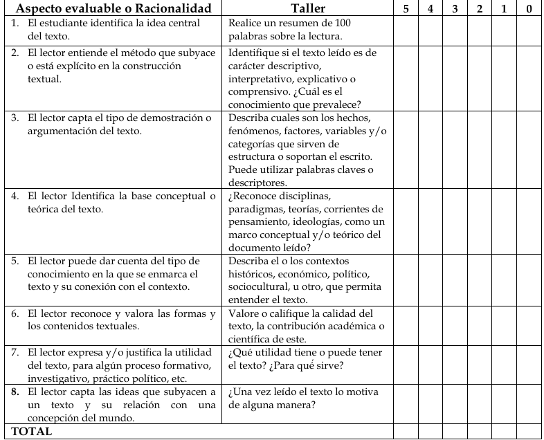

# PENSAMIENTO CRÍTICO EN LA ERA DIGITAL: DESAFÍOS  Y OPORTUNIDADES PARA UNA EPISTEMOLOGÍA DIGITAL. - Gallegos Torres, Rómulo Andrés.
Examinaremos los desafíos y oportunidades para desarrollar el pensamiento crítico en la era digital (epistemologia digital)
Reformas sistémicas y mayor investigación para cerrar la brecha entre la visión de un pensamiento crítico robusto y la realidad educativa.

Segun el filósofo de la educación Matthew Lipman (2003), esta "era digital" plantea preguntas fundamentales sobre la epitemología contemporánea.
Algunos argumentan que Internet re´presenta la "extensión externa del pensamiento humano" al proporcionar acceso instantáneo en ilimitado a información y perspectivas globales.
Tambien se apunta a la sobrecarga de información y las distracciones erosionan habilidades como la concentración, la contemplación y el pensamiento crítico.

Las investigaciones indican una disminución en habilidades esenciales como el *análisis, la evaluación de información* entre los nativos digitales (Guzman & Nussbaum, 2009)

- Pensamiento crítico: Es el proceso intelectualmente disciplinado de conceptualizar, aplicar, analizar, sintetizar y/o evaluar activa y hábilmente la información recopilada o generada por la observación, experiencia, reflexión o comunicación (Scruven & Paul, 2007). En el pensamiento crítico incluyen habilidades como:
- Razonamiento analítico
- La interpretación
- La evaluación de credibilidad
- La metacognición
- La resolución de problemas

La epistemología se enfoca en la naturaleza del conocimiento y los procesos mediante los cuales se genera conocimiento "válido"

### Estado del pensamiento crítico en eduación.

un estudio longitudinal de la Stanford History Education Group (SHEG) midió el desempeño de estudiantes estadounidenses en tareas relacionadas con la evaluación de información en línea de múltiples fuentes. Encontraron una disminución significativa entre 2016 y 2019 en la capacidad de los estudiantes para juzgar la confiabilidad de sitios web, corroborar evidencia y evitar ser engañados por información dudosa (Breakstone et al, 2019).

Un estudio del MIT analizó más de 125,000 historias tuiteadas millones de veces entre 2006 y 2017, encontrando que las noticias falsas tenían 70% más probabilidades de ser retuiteadas que las noticias verdaderas (Vosoughi et al, 2018).

- Infodemia: dificultad de distinguir los hechos de la ficción.

Facebook y Youtube personalizan los feeds de noticias de los usuarios
según sus intereses e interacciones previas, es fácil caer en loops de contenido
sesgado que refuerza creencias existentes (Zuiderveen Borgesius et al, 2016).
Este enfoque algorítmico polariza a los usuarios -> disminuye la exposición a perspectivas divergentes y fomenta la desinformación.

Debe de existir una  un ecosistema de habilidades digitales, estas competencias se basan en 5 áreas:
    - Alfabetización informacional y de datos
    - Comunicación y colaboración digitales
    - Creación de contenido digital
    - Seguridad digital
    - Resolución de problemas técnicos

Varios metaanálisis confirman que enseñar procesos y estándares de razonamiento crítica de manera intencional y explícita mejora el desempeño de los estudiantes en tareas cognitivas complejas (Abrami et al, 2015). Esto involucra instrucción directa en habilidades como hacer preguntas clarificadoras, analizar argumentos, evaluar evidencias y distinguir hechos de opiniones. Las simulaciones digitales y los juegos serios se pueden utilizar para crear escenarios prácticos.

Otro metaanálisis encontró que el aprendizaje basado en problemas aumentaba el pensamiento crítico un 53% comparado con métodos tradicionales.

#### Reflexión metacognitiva

Hay evidencia sólida de que articular, monitorear y reflexionar sobre el
propio pensamiento fortalece las habilidades críticas (Abrami et al, 2015). Las
actividades como escribir diarios de aprendizaje, mapear conceptos, y "pensar
en voz alta" hacen visibles los procesos cognitivos y ayudan a regularlos. Las
plataformas digitales permiten recopilar y representar estas reflexiones para su
análisis continuo.

HINTS: estudio CLA + HEIgthen, siloes de información, camaras de eco, fatiga cognitiva / fatiga de decisión, affordances.

# El pensamiento crítico en la era digital. Un estudio de caso con los estudiantes de Sociología de la Universidad Popular del Cesar (Colombia) - Miguel Chajín F´lorez, Janner Andrés Sanjuanelo Obregón.
El filósofo surcoreano Han (2021) plantea que *hoy nos encontramos en la transición de la era de las cosas a la era de las no-cosas*.

la información puede reforzar la doxa, u opinión e ideología, frente a la episteme o validez, de la sociedad del conocimiento.  

Es por ello por lo que el desarrollo del pensamiento crítico en la educación del siglo XXI es 
fundamental para enfrentarse a los desafíos actuales. Autores como Díaz et al. (2023) y Vidal 
Moruno (2019) destacan la importancia de enseñar a los estudiantes a analizar y seleccionar 
información. Checa Caballero (2023) añade la necesidad de una dimensión ética, mientras 
Moreno Salvo (2021) subraya que **el pensamiento crítico debe ir acompañado de competencias tecnológicas**. Harari (2018) enfatiza la flexibilidad y resiliencia como 
habilidades esenciales para el contexto de incertidumbre global. 

### Las racionalidades del pensamiento crítico en la conmprensión lectora.

Pensar es una acción que implica "descubrir el quién, el qué, el cuándo, el dónde y el cómo de las cosas".

pensamiento crítico digital definido es la “capacidad que 
brota de la conexión entre las competencias digital y social”

partiendo del aprendizaje autónomo se trata de generar la construcción participativa de conocimientos.

Expresa Harari (2018, p. 287) que se requiere la capacidad de **dar sentido a la información**, y 
esto significa decidir seleccionar o ver lo relevante y lo que no importa o aporta; eso está 
relacionado con un cruce de información que permita integrar una mirada general del 
mundo.  
La producción de nuevas ideas, asi como cuestionar y desechar las lecturas que se apartan de la realidad

La enseñanza dialógica se caracteriza porque es "colectiva, recíproca, apoya al alumno, acumulativa y propositiva"

*rubrica para desarrollar el pensamiento crítico*

Puntos claves:
 - Idea central
 - Identificación del tipo de texto:
    - Descriptivo
    - Interpretativo
    - Explicativo
    - comprensivo
 - Tipo de demostración o argumentación:
    son *hechos, fenómenos, factores, variables y/o categorias*?
 - Identificación de la base conceptual o teórica del texto:
    Reconocer:
        - Disciplinas
        - Paradigmas
        - Teorías
        - Corrientes de pensamiento
        - Ideologias

- Describe los contextos históricos, económicos, político, socioculturales y otro, que permita entender el texto
- Calidad del texto, la contribución académica o científica de este.

HINTS: infoxicación, dialógica, Metacógnición, Pedagogía de la pregunta, efecto pigmalión, niveles de conocimiento de un téxto.

# Infomediacion y posverdad: el papel de las bibliotecas. - Mercedes Caridad, Ana María Morales, Sara Martínez. Fátima García.

El neologismo *posverdad*, definido en el diccionario de oxford como aquello *relativo o referido a circunstancias en las que los hechos objetivos son menos influyentes en la opinión pública que las emociones y las creencias personales.*

Hecho: Por otro lado, el término fake news (noticias falsas) copó los 
principales titulares de la prensa y se convirtió en 2017, al 
igual que la anterior, en la palabra del año por el Diccionario 
Collins (Collins Dictionary, 2017). Según éste, su uso ha au
892     
mentado en un 365% después de que Donald Trump fuera 
elegido presidente. Lo que surgió en un ámbito político, ac
tualmente constituye una categorización utilizada en todos 
los contextos informativos.

La posverdad supone un cambio de paradigma en la sesfera política mediática. Minetras la posverdad es una construcción social lenta, el fenómeno *fake news* se aplica a una de las muchas variantes de desinformación generadas en entornos mediáticos caracterizados por su **rapidez y viralidad**

El concepto de posverdad incorpora ciertas novedades:

- los destinatarios no pertenecen a un corpus social homo
géneo, ni con capacidad de mando para modificar deci
siones, y no se trata sólo de una manipulación del objeto (canal y contenido), como en el caso de la desinformación, sino que apela a las convicciones y emociones de los destinatarios; 
- la multiplicidad de canales y la confusión entre emisor y receptor en los medios sociales favorece la imposición rápida del mensaje, algo diferente al concepto de desinformación más clásico; 
- esta simultaneidad favorece la mezcla de información 
veraz con otra que no lo es tanto para fabricar una **verdad alternativa** (término surgido en parte de la nueva extrema derecha como el movimiento Alt-Right (Alter
native-Right).

Estamos inmersos en una realidad compleja que debe ser abordada desde el ámbito: *político, periodísitico y educativo*

Desde el punto de vista de la colectividad ciudadana, constituye un peligro para los sistemas democráticos pudiendo dirigir a los ciudadanos hacia formas particulares de pensar: desinformando o haciendo propaganda sobre personas y acontecimientos.

- Nuevos hábitos en el acceso y uso de la información.
- Contexto político y social
- contexto tecnológico.

A revisar:  Pew Research Center (2017),  el 
Digital news report (Newman et al., 2017), buzzfeednews, Knight Foundation (2017), Joseph Goebbels - 11 principios de la propaganda,

Filtros burbuja: Se trata de la teoría de Pariser (2011) sobre la personalización en sitios web y redes sociales. Este filtro burbuja hace que la información que nos llega sea a través de la personalización y nuestros “me 
gusta” y nos distancie de otras opiniones, lo que refuerza y acorta nuestra visión del mundo.

Categorización de los tipos de noticia falsa:

- fake news : fabrican información falsa o distorsionada

- Sátira: Utilizan el humor o la exageración para categorizar noticias actuales

- Sesgo (Bias): transmiten información descontextualizada y opiniones distorsionadas como hechos

- Teorías conspirativas: difunden teorías excéntricas sobre conspiraciones.

- Creadoras de rumores: difunden rumores, chismes o in
formaciones no verificadas.

- Noticias estatales: se aplica a países represivos en cuanto 
al acceso a la información.

- Ciencia basura (fake science): difunden pseudociencia, 
metafísica o falacias naturistas. - Generadoras de odio: fomentan la misoginia, el racismo, 
la homofobia y otras formas de discriminación.

- Clickbait: información sensacionalista, exagerada y ten
denciosa pero proporcionada por fuentes generalmen
te fiables. Se vincula al uso de titulares engañosos, muy orientados a las redes sociales y a los anuncios por click.

- Proceda con precaución: habitualmente suelen ser fia
bles, pero requieren verificación posterior.- Políticas: proporcionan información generalmente verificable en apoyo de ciertos puntos de vista u orientaciones políticas.

- Creíbles: sujetas a las reglas de la ética periodística tradicional. En este sentido, Zimdars apunta que incluso estas fuentes acuden a un estilo clickbait en titulares, por lo que las organizaciones de noticias no son perfectas, y recomienda la verificación en múltiples fuentes de información.

Estos no son excluyentes entre si

Plataformas digitales que apoyan el periodísmo de calidad: Digital News Initiative -> Fact-Checking Network

 la American Libraries Association (ALA) a través de Programming Libraries ha compilado recursos con el fin de asesorar y guiar a las bibliotecas del país a ofrecer una mejor programación a sus usuarios para perfeccionar sus habilidades a la hora de discernir las noticias falsas. Además, dentro de la iniciativa de concienciación pública Libraries Transform se reivindica el papel tradicional de las bibliotecas en la verificación de hechos y en el fomento del compromiso crítico.
http://www.programminglibrarian.org

¿Noticia falsa?
 - Estudie la fuente
 - Lea más allá
 - ¿Quien es el autor'
 - Fuentes adicionales
 - ¿Compruebe la fecha?
 - Considere el sesgo
 - Existirá patrocinio en los articulos o noticias?
 - Pregunte al experto (sitio web de verificación)

las iniciativas desarrolladas 
por las bibliotecas españolas son meramente testimoniales: únicamente se ha identificado un taller teórico práctico sobre la posverdad del Centro de Documentación del Musac (2017) y una exposición celebrada en la Biblioteca de Humanidades de la Universidad Carlos III de Madrid, también en 2017.

### Referencia digital
Elaboración de recursos o guías temáticas a diseño de modelos colaborativos en los que la integración del personal bibliotecario (embedded librarians) en un entorno especializado pueda servir de *focal point* -> Mediante software en la nube como **Libguides**.

**INCLUSIÓN EN PROGRAMAS DE ALFABETIZACIÓN DIGITAL**

HINTS: brexit, la maoyor parte de la bibliografia científica proviene del sector bibliotecario anglosajon, especialmente mexicano, American Library Association (ALA) , International Federation of library Associations and Institutions (IFLA), Ética periodistica, maldito bulo,  campaña Mil clicks de 
la Unesco (2018), fact checkers.

Google -> ClaimReview , sello schema.org

# PENSAMIENTO CRÍTICO DIGITAL (PCD): HABILIDAD BLANDA RECONCEPTUALIZADA- César Ponciano, Angélica Cajero, Griselda Ramírez,...
Modelo de Pensamiento Crítico Técnologico (MPCT).
Se presenta una propuesta de definición del Pensamiento Crítico Digital (PCG).

el Tecnológico 
Nacional de México ha creado un Modelo de Pensamiento Crítico en la Educación Tecnológica 
(MPCET) que se fundamenta en la construcción y reconstrucción permanente del conocimiento. 
El proceso del modelo se basa en cuatro procesos que podríamos definirlos por su inicial como las 4 
C´s: conozco, confronto, construyo y contribuyo que se definen de la siguiente forma:  

• Conozco: son los referentes con la cuenta la persona para poder interpretar la información de su 
entorno.  

• Confronto: se basa sobre el razonamiento, la argumentación, la lógica y la retórica, de esta forma 
contrasta y contrapone ideas para valorar el conocimiento. 

• Construyo: después de la confrontación se genera la posibilidad de nuevo conocimiento en donde 
la teoría se volca en un proceso reflexivo para transmitir y poner en práctica lo aprendido. 

• Contribuyo: se refiere a la práctica aplicada en diferentes contextos en donde el conocimiento 
construido resuelve y aporta una visión diferente para la solución de problemas complejos.  

Alfabetización digital: definida como una competencia digital, empodera a las personas para generar 
crítica consiente e informada, mediante el uso de las tecnologías de la información y tecnologías 
digitales. Para la Organización de las Naciones Unidas para la Cultura, las Ciencias y la Educación, es 
la “capacidad que permite acceder, gestionar, integrar, comunicar, evaluar y crear informaciones 
mediante la utilización segura y pertinente de las tecnologías digitales para el empleo, un trabajo decente 
y la iniciativa empresarial” (UNESCO, 2025). 
Alfabetización informacional: definida por sus siglas ALFIN, se enfoca en la enseñanza de la búsqueda 
de información para que las personas puedan generar y comunicar conocimiento (Area & Guarro, 2012). 
Analfabetismo digital: se define como la falta de conocimiento sobre el empleo de nuevas tecnologías, 
socializar, acceder y navegar en espacios con contenidos digitales (Expost, 2021). 
Alfabetización mediática digital: se define como la capacidad de acceder, utilizar, comprender, 
relacionarse e interactuar de forma crítica eficaz y responsable con los medios de comunicación que 
nos rodean (MediaSmarts, s.f.). 
Tecnoconocimiento: es la unión entre el conocimiento y la tecnología, el resultado de esta interacción 
genera conocimiento, multiculturalidad y aprendizaje colaborativo mediante el uso de TIC´s (Capítulo  
1. Tecnoconocimiento: conocimiento más tecnología. | Portfolio Educación Social, 2014).

De acuerdo con el sitio Iberdrola, Francis Bacon, filósofo británico del siglo XVI, el pensamiento crítico 
se puede definir como: “… tener el deseo de buscar, la paciencia para dudar, la afición de meditar, la 
lentitud para afirmar, la disposición para considerar, el cuidado para poner en orden y el odio por todo 
tipo de impostura.” 

## Preguntas guia
- ¿Como evaluamos la confiabilidad cuando cualquiera puede publicar contenido en linea?
- ¿Como manejamos la sobrecarga de información?
- ¿Cómo evitamos sesgos cuando estamos expuestos a ecosistemas de noticias personalizadas?

## Personajes influyentes:

- Rubio
